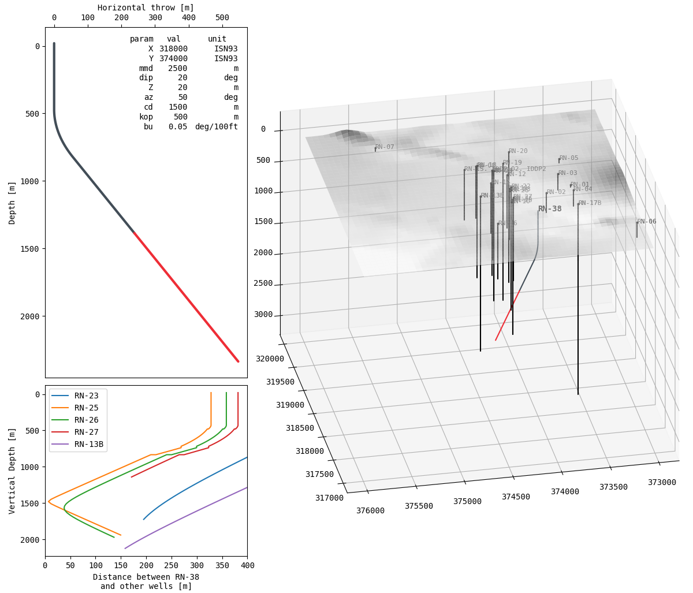

# geowell

Hér höfum við forrit sem dregur upp gagnvirkt líkan af mögulegum holuferli, sjá skjáskot hér að neðan:

### Uppsetning

1. Setjið upp hreint umhverfi (e. environment) í því pakkastjórnunarumhverfi (e. package manager) sem notandinn kýs. `conda` er t.a.m. góður kandídat.

2. Keyrið eftirfarandi í skipanalínunni:

`> cd [folder]`

`> pip install -r requirements.txt`

`> python setup.py`

### Notkun

Í skipanalínunni:

`> python geowell.py --parameter=value`

þar sem `parameter` er eitthvert holuferilsgildanna í `config.json` og `value` er tölugildi.

### Mögulegar viðbætur

- Þrívíddarmyndin höktir (eðlilega) því gagnvirknin í `matplotlib` var ekki hönnuð með hraða í huga. Hægt væri að exporta holuferilinn (og öllu öðru á þrívíddarmyndinni) yfir í `.vtk` og velta um í hugbúnaði sem hannaður er sérstaklega fyrir slíkt, t.d. _Paraview_.

- Setja tvívíddarútgáfu af öllu í vafra með `flask` eða `bokeh` og gera framendann meira í átt að GUI með sleðum og slíku í stað terminal-útgáfunnar sem þessi er. Ekki ósvipað því sem Lárus gerði hjá Vatnaskilum fyrir spálíkanið. Þá gætu fleiri en einn starfsmaður prófað mismunandi parametra.

- Skjálftastaðsetningar

- Þekktar sprungur

- MT þekjur

- Vikmörk holuferils

- Logger sem vistar screenshot af öllum parametrum sem prófaðir eru

- Hafa gervihnattarmynd á tvívíðu korti (ekki skuggamyndina)

### Uppbygging

Bakendinn samanstendur af fjórum eiginleikum:

- nýjum holuferli: `trajectory.py`

- gömlum holuferlum: `wells.py`

- fjarlægð milli nýs holuferils og eldri holuferla: `distance.py`

- hæðarlíkani af jarðhitasvæðinu: `elevation.py`

Nánari lýsingu má finna í möppunni `doc`.